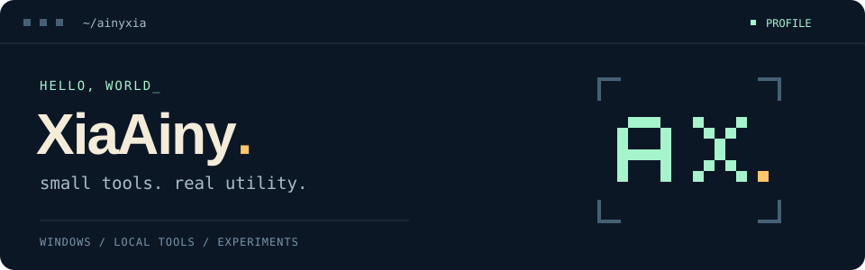

  

  <b>把日常需求，做成顺手的工具。</b> 
  Windows utilities · Local dashboards · Small experiments

  <a href="https://github.com/ainyxia?tab=repositories">项目仓库</a> &nbsp; / &nbsp;
  <a href="https://github.com/ainyxia/ACQuotaScreen">ACQuotaScreen</a> &nbsp; / &nbsp;
  <a href="https://github.com/ainyxia/ACQuotaScreen/issues">交流与反馈</a>

---

### `01` / Hello, world

你好，我是 **XiaAiny**。这里记录我的工具实践和小实验。

从桌面上的小需求出发，让状态更直观，让操作更顺手。

### `02` / Featured project

#### [ACQuotaScreen ↗](https://github.com/ainyxia/ACQuotaScreen)

**让一块小副屏，承载你关心的运行状态。**

面向 Windows 的本地监控工具，把 Codex 额度、重置时间与电脑硬件状态放到副屏上。

| 额度一眼可见 | 桌面状态常驻 | 界面自由调整 |
| :--- | :--- | :--- |
| 官方 Codex / Codex++ 来源切换 | CPU、GPU、内存与网络监控 | 多主题、多布局与自定义 CSS |

[查看源码 →](https://github.com/ainyxia/ACQuotaScreen) &nbsp; · &nbsp; [运行与配置 →](https://github.com/ainyxia/ACQuotaScreen#快速开始)

### `03` / Project toolkit

当前公开项目用到的技术与平台：

`Python` &nbsp; `Flask` &nbsp; `Windows` &nbsp; `WebView` &nbsp; `PowerShell`

---

  <samp>small tools. real utility.</samp> 
  一点点打磨，一点点进步。

